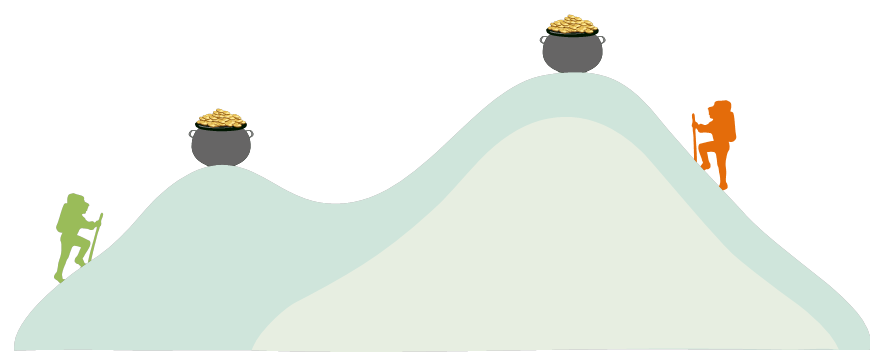

```{r setup, include=FALSE}
knitr::opts_chunk$set(echo = FALSE)
```

---

# Intros

 - Name
 - Background in R
 - Background in GIS
 - What you hope to get out of the class

# Course Format

Each week we will cover

 - R fundamentals
 - Spatial operations
 - Exercises

# Course Outline

```{r test-main, child = 'course_outline.Rmd'}
```

# Course Goal

<div style="text-align: center;">
<br/>
<span style="color:darkred;">Whereever you are, be a little higher on the learning curve!</span>
</div>


# Course Materials

Etherpad: https://is.gd/rspatial_baygeo_s18

GitHub: https://github.com/ajlyons/rspatialdata

# RStudio Tour

## Install the following packages

- raster
- sp
- rgdal
- ggplot2

# Next

[R Syntax and Packages](part01b_packages_rsyntax.html)