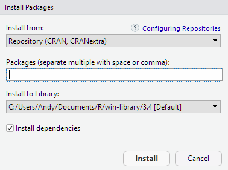

```{r setup, include=FALSE}
knitr::opts_chunk$set(echo = TRUE)
```

# Finding Packages

People in your field

CRAN Task Views *e.g., <https://cran.r-project.org/web/views/Spatial.html>*

## R Spatial Ecosystem

<div class="centerblock"></img></div>

# Installing and Loading

Install = download

*RStudio Packages Tab*

<div class="indented2">

</div>

_From CRAN repositories_

```{r, eval=FALSE, echo=TRUE}
install.packages("raster")
```

Specifying a specific repository:

```{r, eval=FALSE, echo=TRUE}
install.packages("raster", dependencies = TRUE, repos="http://cran.cnr.berkeley.edu/")
```

_From GitHub_

```{r, eval=FALSE, echo=TRUE}
library(devtools)
install_github("sidtraits", "Koalha")
```

_Installation Errors_

```{r, echo=TRUE, eval=FALSE}
install.packages("Roster", repos="http://cran.cnr.berkeley.edu/")
```

```{r, eval=F}
## Warning: package 'Roster' is not available (for R version 3.4.4)
```


Most of the time, a warning like this means the package doesn't exist at all.

_Loading_

Load = bring into memory so you can use it in R

```{r, echo=TRUE, eval=FALSE}
library(raster)
```

```{r, echo=TRUE, eval=FALSE}
require(raster)
```

*Unload*

```{r, echo=TRUE, eval=FALSE}
detach("package:raster")
```

*Update*

```{r, echo=TRUE, eval=FALSE}
## update all installed packages
update.packages() 

## update a single package
update.packages(oldPkgs="raster")
```

# What's in a package?

```{r, echo=FALSE, results='asis'}
library(kableExtra)
tbl_vec <- c("Index of all help topics", "help(package=\"maptools\")", "Vignettes", "browseVignettes(package = \"raster\")", "Bundled datasets", "data(package=\"myPackge\")", "Installation directory", "system.file(package = \"maptools\")", "Files", "system.file(\"external/countries.csv\", package=\"raster\")", "Bundled demos", "demo(package=\"sp\")", "Run a demo", "demo(webmap)")
tbl_mat <- matrix(tbl_vec, byrow=TRUE, ncol=2, dimnames=list(1:(length(tbl_vec)/2), c("Content", "Cmd")))
knitr::kable(tbl_mat, format = "html", table.attr='class="tbl_compact"') %>% column_spec(column=2, monospace = TRUE)
```

*Datasets*

To view the datasets in the package *sp*, run

```{r, eval=FALSE}
data(package="sp")
```

To see a list of datasets in all packages currently loaded, run data() without an argument.

```{r, eval=FALSE}
data()
```

To see *all* datasets in *all* installed packages, run

```{r, eval=FALSE}
data(package = .packages(all.available = TRUE))
```

# Dealing with duplicate function names

Sometimes two or more packages will have a function with the same name.  

R will use whichever one it finds first.

Best Practice: use the package name and the <tt>::</tt> reference to specify which package a function is from.

```{r, eval=FALSE}
x <- sp::over()
x <- grDevices::over()
```


# Next Up

[Exercise 2. Working with Packages](../exercises/ex02_packages.html){target="_blank"}

[Importing and Plotting Spatial Data](part01d_import_plot.html)


