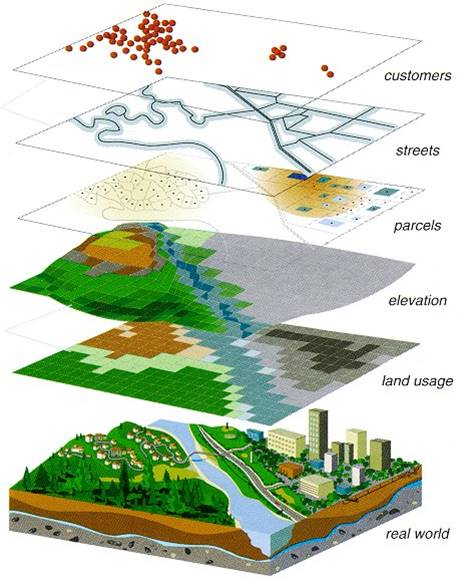
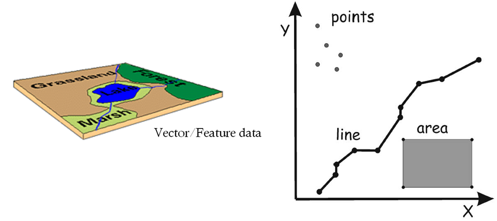
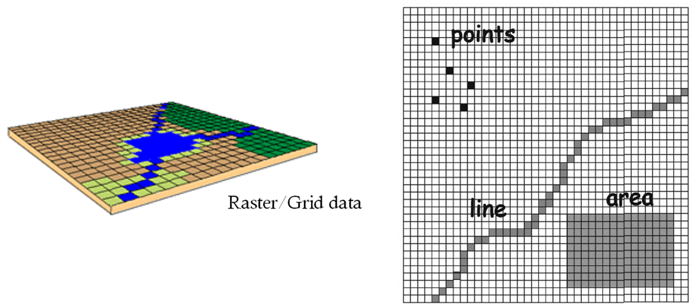
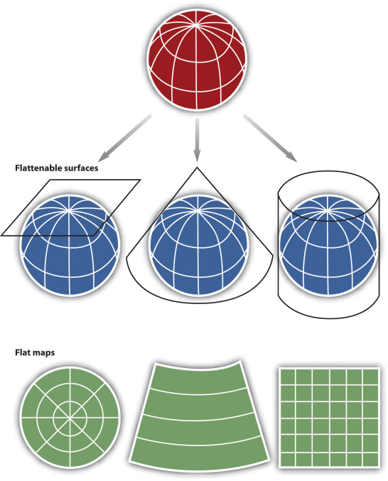

```{r setup, include=FALSE}
knitr::opts_chunk$set(echo = TRUE)
```

# Spatial Data

<div class="incremental"><div>
__Physical World &rarr; GIS World__

<div class="incremental centerblock" style="margin-bottom:2em;"></img></div>

<div class="incremental centerblock" style="margin-bottom:2em;"></img></div>

<div class="incremental centerblock" style="margin-bottom:2em;"></img></div>

</div></div>

<div class="incremental"><div><hr class="hrdivider">
__Projections__
<div class="centerblock"></img></div>
</div></div>

<div class="centerblock" style="margin-top:2em;">
<iframe src="http://www.jasondavies.com/maps/transition/" style="width:1234px;height:732px;">
  <p>Your browser does not support iframes.</p>
</iframe>
</div>

# Representing Geographic Data 

How would you represent each of the following?

<div class="indented2">
>- city, county, state boundaries
>- air or ocean temperature
>- crime locations
>- buildings
>- roads
>- water fountains
>- elevation
>- soil type
>- land use
</div>

# Importing Vector Data: rgdal

<div class="indented1">
- <tt>rgdal</tt> is a wrapper for the Geospatial Data Abstraction Library (GDAL) library.

- It provides drivers for a wide range of vector and raster data formats.

- Data come in as Spatial* objects (<tt>sp</tt> package).

- Knows how to read project info
</div>

```{r echo=TRUE, results='hide', message=FALSE}
library(sp)
library(rgdal)
```

## Import Shapefiles

View layers in a directory:

```{r echo=TRUE, eval=FALSE}
library(rgdal)
ogrListLayers(dsn)
```

Where _dsn_ is a directory.

```{r}
ogrListLayers("../exercises/data")
```

View metadata before importing:

```{r echo=TRUE, eval=FALSE}
ogrInfo(dsn, shape_file_name)
```

where _shape_file_name_ is the name of the directory, minus the _.shp_ extension

To import, use ```readOGR()```

```{r import_shp, echo=TRUE}
ca_counties <- readOGR("../exercises/data", "ca_counties_census")
summary(ca_counties)
```

## Import a KML

```{r import_kml, echo=TRUE}
kml_fn <- "../exercises/data/berkeley_public_sites.kml"
file.exists(kml_fn)
ogrListLayers(kml_fn)
brk_sites <- readOGR(kml_fn, "Public Facilities")
summary(brk_sites)
```

More info on importing spatial data with rgdal from [Zev Ross](http://zevross.com/blog/2016/01/13/tips-for-reading-spatial-files-into-r-with-rgdal/).

# Plotting

## Basic Plotting

<div class="indented1">
Vector layers can be viewed with the basic <tt>plot()</tt> function

There are lots of optional arguments to make it look nicer

There are plotting packages for even nicer output (e.g., <tt>ggplot2</tt>)
</div>

```{r plot_ca, fig.align="center", cache=TRUE, out.height=400}
plot(ca_counties)
```

Notice how its squished? We can fix that with the ```asp``` argument (aspect ratio).

```{r plot_asp1, cache=TRUE}
plot(ca_counties, asp=1)
```

Other common arguments for ```plot()```

<div class="compact">
- type - type of plot (_p_=point, _l_=line, _b_=both)
- pch - plot character
- cex - character expansion factor (1=normal size)
- lwd - line width
- lty - line type
- col - fill
- border - outline color
- main - title
- xlab, ylab - set labels for the x and y axes
- asp - aspect ratio (set _asp=1_ for geographic data)
- axes - whether or not to display axes
- add - set add=TRUE to overlay new feaures on current plot
</div>

_Plotting Examples_

Here we pass the ```col``` argument to give the polygon a fill.

```{r plot_multicolors, cache=TRUE}
palette()
plot(ca_counties, col=palette(), asp=1)
```

## Other Plotting Packages

<div class="indented2">
- Plotting functions in the base package are quite basic
- For nicer looking plots, check out the packages ```tmap```, ```ggmap```, or ```lattice```
</div>

# Next Up

[Exercise 3. Import and Plot Spatial Data](../exercises/ex03_import_plot.html){target="_blank"}


