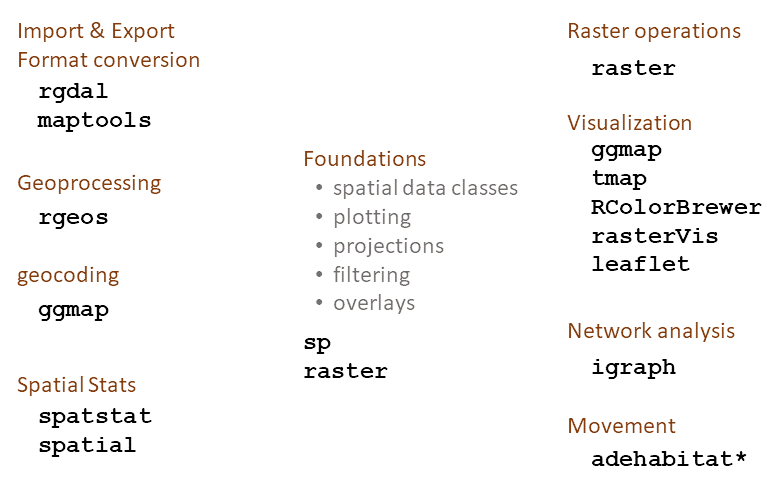

```{r setup, include=FALSE}
knitr::opts_chunk$set(echo = TRUE)
library(kableExtra)
```

---

# Course Outline

```{r test-main, child = 'course_outline.Rmd'}
```

# Review of Last Week

## R Syntax 

<div class="indented2">
- case sensitive
- console - where commands get executed
- script (source) window - can save commands to a files
</div>

## Operators

<div class="indented1">
### Math 

<pre class="nofrills">+    -    *    %    :    %%    %/%</pre>

### Comparison

<pre class="nofrills">==    !=</pre>

<pre class="nofrills">>    >=    <    <=    <</pre>

<pre class="nofrills">%in%</pre>

</div>

## Functions

<div class="indented1">
### Math

<tt>seq(), c(), sample(), runif(), log(), mean(), sum(), table()</tt>

### Finding out about objects

<tt>class(), summary()</tt>

### Controlling the R environment

<tt>setwd(), getwd()</tt>

</div>

## Variables

<div class="indented2">
<tt>x = "san francisco"</tt>  

<tt>x <- "san francisco"</tt>
</div>

## Data Classes

<div class="indented2">
- vector  
    + character  
    + numeric  
    + Boolean  
    + factor
- lists
- data frames
- matrices
</div>

## Vectorized Functions

```{r}
x <- 1:3
x ^ 2
log(x)
```


## Filtering with Square Brackets

Option 1: pass a vector of integers:

```{r}
x <- 4:6  
idx <- c(1,2)
x[idx]
```

Option 2: pass a vector of Booleans:

```{r}
idx <- c(T,T,F)
x[idx]
```

Option 3: pass an expression or function which returns a vector of Booleans:

```{r}
x > 4
x[ x > 4 ]
```

## Packages

<div class="indented1">

Packages are collections of: 

<div class="indented1">
- functions  
- help pages  
- Vignettes*  
- data*  
- demo*  
\* = sometimes
</div>

Find packages through colleagues, people in your field, [CRAN Task Views](https://cran.r-project.org/web/views/)

Install = download  
<tt>install.packages()</tt> (or use RStudio)  

Load = bring into your R session  
<tt>library()</tt> or <tt>require()</tt>
</div>

## Spatial Data Pacakges Ecosystem

<div class="centerblock"></img></div>

## Importing Spatial Data 

<tt>rgdal</tt>

<div class="indented1">
- ogrListLayers()
- ogrInfo()
- readOGR()
- writeOGR()
- ogrDrivers()
</div>

## Basic Plotting

<tt>plot(x)</tt>  

Where <tt>x</tt> can be a:

<div class="indented1">
- Spatial* object
- 2-column matrx or data frame (scatterplots or lines)
</div>

## Top Five Arguments for Plotting Spatial Data

```{r, echo=FALSE}
plot_args_vec <- c("asp = 1", "aspect ratio", "col=\"red\"", "fill color", "border=\"blue\"", "outline color", "pch=16", "point symbol (16 = round dot)", "axes = TRUE", "draw axes")
plot_args_df <- matrix(plot_args_vec, byrow=TRUE, ncol=2, dimnames=list(1:(length(plot_args_vec)/2), c("Argument", "Effect on Plot")))
knitr::kable(plot_args_df, format = "html", table.attr='class="tbl_compact"') %>% column_spec(column=1, monospace = TRUE)
```

# Today

## More R Fundamentals

<div class="indented2">
- sorting
- dealing with missing values
- lists
- factors
- data frames and matrices
- Rmarkdown
</div>

## Spatial Data

<div class="indented2">
- projections
- geoprocessing
- attribute queries
- spatial overlays 
</div>

# Next Up

[Sorting, Saving, and Other Fundamentals](part02b_sort-save-misc.html)

