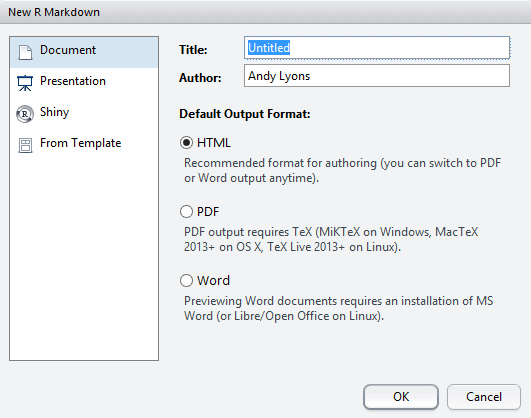
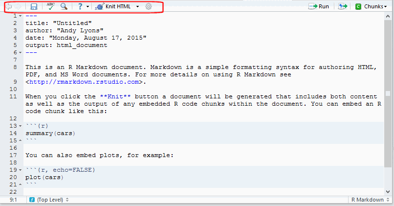
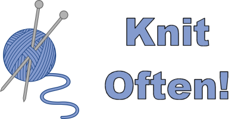
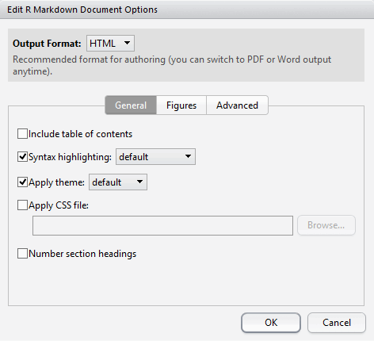

```{r setup, include=FALSE}
suppressPackageStartupMessages(library(knitr))
library(kableExtra)
knitr::opts_chunk$set(echo = TRUE)
hook_source_def = knit_hooks$get('source')
knit_hooks$set(source = function(x, options){
  if (!is.null(options$verbatim) && options$verbatim){
    opts = gsub(",\\s*verbatim\\s*=\\s*TRUE\\s*", "", options$params.src)
    bef = sprintf('\n\n    ```{r %s}\n', opts, "\n")
    stringr::str_c(bef, paste(knitr:::indent_block(x, "    "), collapse = '\n'), "\n    ```\n")
  } else {
     hook_source_def(x, options)
  }
})
```

# Extending a Generic Document Language

<div class="compact">
- Markdown is a simple formatting syntax for authoring dynamic documents
- Simpler to write than LaTeK or HTML
- Tools to convert Markdown files to HTML, PDF, and MS Word document.
    + Usually can evaluate expressions from one or more languages (JS, Python)
- R Markdown is a flavor of Markdown that allows you to embed and run R code, include plots
</div>

<pre class="scrolling-code" style="height:40%">
---
title: "Analysis of the Speed and Stopping Distances of Cars"
author: "Andy Lyons"
date: "Monday, August 1, 2015"
output: html_document
---

## Trailing Distance Safety: Why the Two-Second Rule May Just Kill You

### Elements of Stopping Distance

One aspect of safe driving involves the ability to stop a car readily. This
ability depends upon the driver's alertness and readiness to stop, the
conditions of the road, the speed of the car, and the braking characteristics of
the car. The actual distance that it takes to stop the car can be thought of as
consisting of two parts: the reaction distance and braking distance. 

When a driver sees an event in his/her field of view that might warrant braking
(for example, a dog running into the street), a collection of actions must be
taken before the braking actually begins. First the driver must identify the
event and decide if braking is necessary. Then the driver must lift his/her foot
off the gas pedal and move it to the brake pedal. And finally, the driver must
press the brake down its full distance in order to obtain maximum braking
acceleration. The time to do all this is known as the reaction time. The
distance traveled during this time is known as the __reaction distance__. Once
the brakes are applied, the car begins to slow to a stop. The distance traveled
by the car during this time is known as the __braking distance__. The braking
distance is dependent upon the original speed of the car, the road conditions,
and characteristics of the car such as its profile area, mass and tire
conditions. 

&#96;``{r}
library(ggplot2)
stop_dist <- read.csv("stopping_dist_cars.csv", stringsAsFactors=FALSE, strip.white=TRUE)
stop_dist <- transform(stop_dist, total_dist=breaking_dist + reaction_dist) 
ggplot(data=stop_dist, aes(x=speed, y=total_dist, group=surface, colour=surface)) + 
geom_line() + geom_point() + ggtitle("Total Stopping Distance by Speed") + 
xlab("Speed (km/h)") + ylab("Total stopping distance (m)")
&#96;``

### Vehicle Performance and Stopping Distance

The data give the speed of cars and the distances taken to stop. Note that 
the data were recorded in the 1920s.

&#96;``{r}
plot(cars)
&#96;``

Source: Ezekiel, M. (1930) Methods of Correlation Analysis. Wiley.

</pre>

# R Markdown: Support in RStudio

<div style="margin-left:2em;">

<p></p>

<p></p>

</div>

For more details, see [http://rmarkdown.rstudio.com](http://rmarkdown.rstudio.com){target="_blank"}.

# Practice 1

1. Create a new markdown document
    + select HTML output
1. Change the title, author, date
1. Knit to HTML
1. Save Rmd file

<div class="incremental">
<div style="text-align:center; margin: 50px 0px;">

</div>
</div>

# R Markdown: Flavors

<div class="compact">
- All varieties of R Markdown support the majority of R Markdown syntax
    + formatting
    + styles
    + code chunks
- Different 'flavors' of R Markdown provide additional functionality and customization
- Each flavor generally designed for a specific type of output
    + documents
    + presentation (RPresentations, ioslides, slidy, slidify, beamer)
    + app (Shiny)
</div>

<div class="incremental"><div>
__All R Markdown is Merely A Means to an End__

\*.Rmd &#8594; <span class="pkgname">knitr</span> &#8594; \*.md &#8594; <span class="pkgname">pandoc</span> &#8594; <span style="display:inline-block; margin-left:0.6em; vertical-align:middle; text-align:left;">\*.pdf (requires TeK also)<br><br>\*.doc<br><br>\*.html (+ \*.css, \*.js \*.ttf)</span>
</div></div>

# R Markdown: Anatomy of a Document

<div class="colleft" style="width:20%;">

YAML section

Paragraph text

Code chunks

</div>

<div class="colright" style="width:75%; height:20%;">
<pre class="scrolling-code" style="height:450px;">
---
title: "Untitled"
author: "Andy Lyons"
date: "Monday, August 17, 2015"
output: html_document
---

This is an R Markdown document. Markdown is a simple formatting syntax for
authoring HTML, PDF, and MS Word documents. For more details on using R Markdown
see <http://rmarkdown.rstudio.com>

When you click the **Knit** button a document will be generated that includes
both content as well as the output of any embedded R code chunks within the
document. You can embed an R code chunk like this:

&#96;``{r}
summary(cars)
&#96;``

You can also embed plots, for example:

&#96;``{r, echo=FALSE}
plot(cars)
&#96;``

Note that the `echo = FALSE` parameter was added to the code chunk to prevent
printing of the R code that generated the plot.
</pre>
</div>

<div class="colclear"></div>

# R Markdown: YAML

<div class="incremental">
<div>
Standard stuff

<pre class="markdown">
---
title: "Interactive Data Visualization"
author: "Andy Lyons"
date: "Friday, August 18, 2015"
output: slidy_presentation
---
</pre>
</div>

<div>
Other Common Options

<pre class="markdown">
output:
  html_document:
    fig_height: 4
    fig_width: 4
    smart: no
    toc: true
    toc_depth: 2
    theme: journal
    <strong>self_contained: no</strong>
</pre>
</div>

<div>
Easy Way to Change Common YAML Options




</div>

<div>
Flavor Specific Options

<pre class="markdown">
output:
  slidy_presentation:
    incremental: true
    highlight: pygments
    font_adjustment: -1
    duration: 45
    mathjax: local
    footer: "Berkeley R Language Beginner Study Group, Aug. 18, 2015"
    includes:
      in_header: idv_header.html    
</pre>
</div>

</div>

# R Markdown: Paragraph Text

Formatting paragraph text is easy. See the 'Markdown Quick Reference' to get started. Start a new paragraphs with a blank line.

### Emphasis

```
*italic*   **bold**
_italic_   __bold__
```

### Headers

```
# Header 1
## Header 2
### Header 3
```

### Lists

Unordered List

```
* Item 1
* Item 2
    + Item 2a
    + Item 2b
```

Ordered List

```
1. Item 1
2. Item 2
3. Item 3
    + Item 3a
    + Item 3b
```

### Manual Line Breaks

End a line with two or more spaces:

```
Roses are red,   
Violets are blue.
```

### Links

Use a plain http address or add a link to a phrase:

```
http://example.com

[linked phrase](http://example.com)
```

### Images

Images on the web or local files in the same directory:

```


```

### Blockquotes

A friend once said:
```
> It's always better to give 
> than to receive.
```

For more info, see <http://rmarkdown.rstudio.com/>

# Practice 2

- Click on 
- Play with 
    + theme
    + TOC
    + syntax highlighting
    + self-contained
- Knit HTML
- Note changes in
    + HTML page - font, colors, style, etc.
    + YAML section
    + additional files and folders in HTML folder


# Code Chunks

```{r verbatim=TRUE}
x = 16000 + rnorm(30) * 3000
plot(x, type="b", pch=20, 
     main="Dow Jones Index")
```


# Code Chunk Options

<div class="colleft" style="width:55%;">

<pre class="markdown">
&#96;``{r, <strong>echo=FALSE</strong>}
x <- 16000 + rnorm(30) * 3000
plot(x, type="b", pch=20, 
     main="Dow Jones Index")
&#96;``
</pre>

```{r echo=FALSE, verbatim=TRUE}
x <- rnorm(30) * 1000
plot(x, type="b", pch=20, 
     main="Dow Jones Index")
```

</div>

<div class="colright" style="width:45%;">
Useful Code Chunk Options

- <code>echo=FALSE</code>. Don't show the code
- <code>message=FALSE</code>. Don't show output messages
- <code>cache=TRUE</code>. Save the plot image for reuse
- <code>results='hide'</code>. Don't show any output
- <code>results='asis'</code>. The output is HTML code, not R output
- <code>fig.height=3, fig.width=4</code>. Set the height and width of figures
- many others - see R Markdown Reference
</div>

<div class="colclear"></div>

# Code Chunk Environment

- All code in a R Markdown document is executed in a separate environment
- This means all libraries and data objects have to be loaded in the R Markdown document (i.e., in a code chunk)
    + The packages and objects loaded in your base environment won't do you any good :-(
- Method behind the madness: reproducible research

<div class="incremental">
<div class="colleft">
Bad Code Chunk

```{r ggplotspeed, echo=TRUE, eval=FALSE}
ggplot(data=stop_dist, aes(x=speed, y=total_dist, 
        group=surface, colour=surface)) +
        geom_line() + geom_point()
```

This will NOT work, because,

i) `ggplot()` is a not a 'built-in' function. This is a function from the ggplot2 package, which hasn't been loaded yet
ii) the data frame <i>brake_dist</i> hasn't been loaded into the R Markdown yet. Whether or not it exists in our base environment doesn't matter for the purposes of R Markdown.
</div>

<div class="colright">
Working Example

```{r ggplotcars2, fig.width=4, fig.height=3}
library(ggplot2)
stop_dist = read.csv(file.path("../exercises/data", "stopping_dist_cars.csv"), 
             stringsAsFactors=FALSE, strip.white=TRUE)
ggplot(data=stop_dist, aes(x=speed, y=total_dist, 
       group=surface, colour=surface)) +
       geom_line() + geom_point()
```
</div>
</div>

<div class="colclear"></div>


# Inline R Expressions

You can insert an 'inline' R expression by wrapping in single back-ticks. Remember to add 'r' after the leading back-tick to indicate this is an expression that should be evaluated.

For example:

<pre class='markdown'>The area of a circle with radius 5 is &#96;r pi * 5^2&#96;.</pre>

Becomes: 

The area of a circle with radius 5 is `r pi * 5^2`. 

# R Markdown Resources

[Cheat sheet](https://www.rstudio.com/wp-content/uploads/2016/03/rmarkdown-cheatsheet-2.0.pdf){target="_blank"}

[Reference Guide](https://www.rstudio.com/wp-content/uploads/2015/03/rmarkdown-reference.pdf){target="_blank"}

# Next-Up

[Spatial Data Operations](part02e_spatial-data.html)


