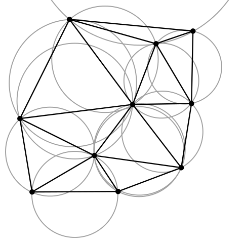

```{r setup, include=FALSE}
knitr::opts_chunk$set(echo = TRUE)
knitr::knit_hooks$set(small.mar = function(before, options, envir) {
    if (before) par(mar = c(2, 2, 0.5, 0.5))
})
library(kableExtra)
library(rgdal)
library(rgeos)
```

# rgeos package

Wrapper for the Geometry Engine Open Source (a C++ port of the Java Topology Suite).

```{r}
require(rgeos)
```

## Functions Sampler

<div style="width:1120px; border:1px solid white;">
<div style="width:350px;float:right;border:0px solid green;">
__Spatial Proximity Tests__  
<tt>gContains()  
gCovers()  
gEquals()  
gIntersects()  
gOverlaps()  
gTouches()  
gWithinDistance()</tt>
</div>

<div style="width:400px;float:right;border:0px solid blue;">
__Create New Geometries__  
<tt>gBuffer()  
gConvexHull()  
gDifference()  
gIntersection()  
gSimplify()  
gUnion()</tt>
</div>

<div style="width:330px;border:0px solid magenta;">
__Geometric Properties__  
<tt>gArea()  
gCentroid()  
gDistance()  
gLength()</tt>
</div>
</div>

<div style="clear: both;"></div>

Many functions from rgeos have a <tt>byid</tt> argument. byid=TRUE means applies the processing to individual features.  

# Examples

## Load Some Data

To try it out, let's open the SF neighboods and cannabis dispensaries you opened in an earlier exercise.

```{r import_plot_sf_nb_pot, fig.align="center", small.mar=TRUE, cache=TRUE}
library(rgdal)
sf_nb_ll <- readOGR("../exercises/data", "sf_neighborhoods")
fn <- "../exercises/data/sf_permitted_cannabis_dispensaries_2014.kml"
sf_pot_ll <- readOGR(fn, "Cannabis Dispensaries 2014")
plot(sf_nb_ll, axes=T, asp=1)
plot(sf_pot_ll, add=T, col="red", pch=16)
```

## Project the Data

Distance and area are only meaningful with projected data. Hence you typically project data before geoprocessing.

Project the San Francisco data to UTM Zone 10

```{r proj_utm, small.mar=TRUE, fig.align="center", cache=TRUE}
utm10n <- CRS("+proj=utm +zone=10 +ellps=WGS84")
sfnb_prj <- spTransform(sf_nb_ll, utm10n)
sfpot_prj <- spTransform(sf_pot_ll, utm10n)
plot(sfnb_prj, axes=T, asp=1)
plot(sfpot_prj, add=T, col="blue", pch=16)
```

# Area and Centroids

<tt>gArea()</tt>

```{r}
sfnb_area <- gArea(sfnb_prj, byid=TRUE)
str(sfnb_area)
```

<tt>gCentroid()</tt>

```{r nb_ctr, small.mar=TRUE, fig.align="center", cache=TRUE}
sfnb_ctr_sp <- gCentroid(sfnb_prj, byid=TRUE)
class(sfnb_ctr_sp)
plot(sfnb_prj, axes=TRUE, asp=1)
plot(sfnb_ctr_sp, col="purple", pch=17, cex=1.2, add=TRUE)
```

# Buffers

<tt>gBuffer(*spgeom*, *byid*, *id*, *width*)</tt>

- spgeom: must be a SpatialPolygon* object  
- byid: apply to individual features
- width: in map units, (postive=outer buffer, negative=inner

```{r bufpot_byidt, small.mar=TRUE, fig.align="center", cache=TRUE}
buff_dist <- 1000 * 0.3048  ## 1000 ft in meters
sfpot_buf_prj <- gBuffer(sfpot_prj, byid=T, width=buff_dist)
plot(sfpot_buf_prj, axes=TRUE)
```

Note the difference that <tt>byid=F</tt> makes:

```{r bufpot_byidf, small.mar=TRUE, fig.align="center", cache=TRUE}
sfpot_buf_prj <- gBuffer(sfpot_prj, byid=F, width=buff_dist)
plot(sfpot_buf_prj, axes=TRUE)
```

# Intersections

Intersect the buffered dispensaries with just one of the neighborhood boundaries.

```{r plot_msg, small.mar=TRUE, fig.align="center", cache=TRUE}
nb_name <- "Mission"
mission_bnd <- sfnb_prj[sfnb_prj@data$nhood==nb_name, ]
mission_intrsct_pot <- gIntersection(mission_bnd, sfpot_buf_prj)
plot(mission_bnd, axes=T, asp=1)
plot(mission_intrsct_pot, col="red", add=T)
```

Compute the percentage of the Mission neighborhood that falls within 1000 feet of a cannabis dispensary.

```{r compute_prp, cache=TRUE}
gArea(mission_intrsct_pot) / gArea(mission_bnd)
```

# Delaunay Triangulation 

*Delaunay Triangulation*: a triangular network connecting a set of points such that for each edge we can find a circle containing the edge's endpoints but not containing any other points. 




Create a Delaunay Triangulation for the cannabis dispensaries.

```{r delaunay_tri, fig.align="center", small.mar=TRUE, cache=TRUE}
sfpot_deltri <- gDelaunayTriangulation(sfpot_prj)
plot(sfpot_prj, col="red", pch=16, cex=2, axes=TRUE)
plot(sfnb_prj, border="grey60", add=TRUE)
plot(sfpot_deltri, add=TRUE, border="darkorchid3", lwd=2)
```

# Convex Hull / Minimum Convex Polygon

```{r chull_plot, small.mar=TRUE, fig.align="center", cache=TRUE}
sfpot_ch <- gConvexHull(sfpot_prj)
plot(sfpot_prj, col="red", pch=16, cex=2, axes=TRUE)
plot(sfnb_prj, border="grey60", add=TRUE)
plot(sfpot_ch, add=TRUE, border="darkorchid3", lwd=2)
```

See also <tt>chull()</tt> from the *grDevices* package (part of the base R installation)

# Next Up

[Exercise 7. Geoprocessing](../exercises/ex07_geoprocessing.html){target="_blank"}

*See also:*

[Merging Spatial Data](http://www.nickeubank.com/wp-content/uploads/2015/10/RGIS2_MergingSpatialData_part2_GeometricManipulations.html){target="_blank"}, Nick Eubank
